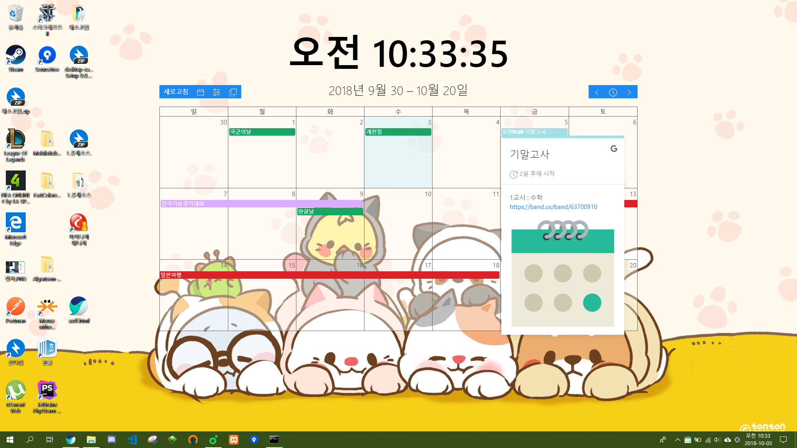

# desktop-calendar

> electron-vue(vuikit)으로 제작한 desktop calendar

## Library
* [Electron-Vue](https://github.com/SimulatedGREG/electron-vue)
* [Electron-Builder](https://github.com/electron-userland/electron-builder)
* [Vuex](https://github.com/vuejs/vuex)
* [Vuikit](https://vuikit.js.org/)[(UIkit)](https://getuikit.com/)
* [Google Calendar API](https://developers.google.com/calendar/)
* [FullCalendar](https://fullcalendar.io/docs)

## Build Status
* [Travis CI](https://travis-ci.org/)
* [Appveyor](https://www.appveyor.com/)

# Intro
## Windows

## mac

This project was generated with [electron-vue](https://github.com/SimulatedGREG/electron-vue)@[32ecf6a](https://github.com/SimulatedGREG/electron-vue/tree/32ecf6aebd2e2c28ad2628f151697529e442e679) using [vue-cli](https://github.com/vuejs/vue-cli). Documentation about the original structure can be found [here](https://simulatedgreg.gitbooks.io/electron-vue/content/index.html).
